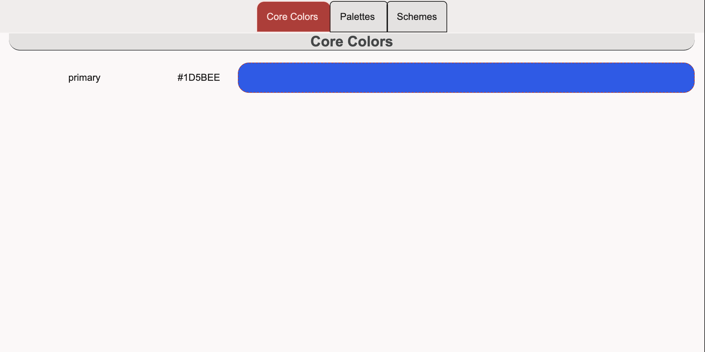
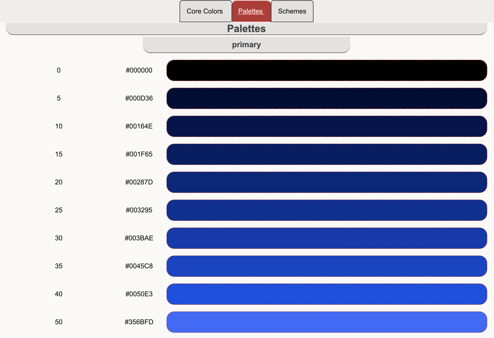
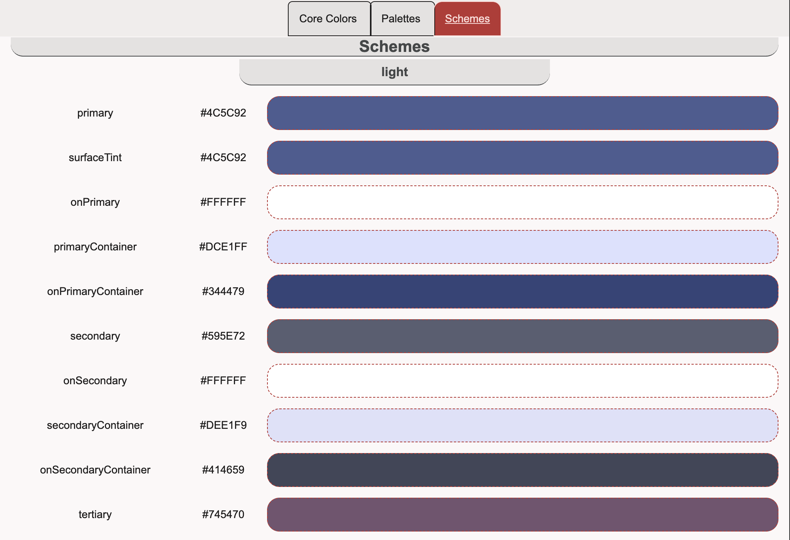

# material-theme-viewer

This simple [`material-theme-viewer.html`](./material-theme-viewer.html) and [`material-theme.json`](./material-theme.json) pair provides a straight-forward way to view the 3 core components to a Material Theme `JSON` file, as produced by [Material Theme Builder](https://material-foundation.github.io/material-theme-builder/).  Through a simple tabbed interface, the `material-theme-viewer` displays the `Core Colors`, `Palettes` and `Schemes` generated by the `Theme Builder` in a straight-forward manner.

Designed to run exclusively in the browser, the `material-theme-viewer` expects a `material-theme.json` file as produced by the `Material Theme Builder` and looks for the file as a *sibling* to the `material-theme-viewer.html` file itself.  Since this is a browser-based experience, it is required to use a (simple) `HTTP` server to fully experience the `material-theme-viewer`.  In such cases, a straight-forward `node` or `python3*` server will suffice.

## Core Colors

When building a `Material Theme`, a source image or source colors are input to the algorithm.  These sources are included in the final `.json` file.

## Palettes

Sometimes also known as "Color Ramps", the `Palettes` constitute all of the "potential color candidates" used to create the final `Material Theme`.  Colors are chosen from these `Palettes` and paired with one another to form contrast-appropriate pairs and provide `Material Theme` instances with a hefty set of colors.  Similarly, variations of a given `Material Theme` `Scheme` (see below) are drawn from these same `Palettes`.

## Schemes

The `Material Theme` `Schemes` are the **actual** collection of semantically-named colors expected to be used through-out the UI.  Entries in the `Scheme` range from `Color/onColor` pairs to various  `container` styles intended to emphasize a layered structure to a User Interface.  Roles like `primary` and `secondaryContainer` and `onSurface` come from the `Material Theme Scheme` [Color Token definitions](https://m3.material.io/foundations/design-tokens/overview).  The naming convention is meant to guide use-cases of a particular role/color with proper due diligence.

### The Site

The `HTML` within [`material-theme-viewer.html`](./material-theme-viewer.html) consists of a simple `fetch` call to [`material-theme.json`](./material-theme.json) followed by auto-generation of the page contents.  There is a strong assumption that the `Material Theme Builder`'s output remains constant.
